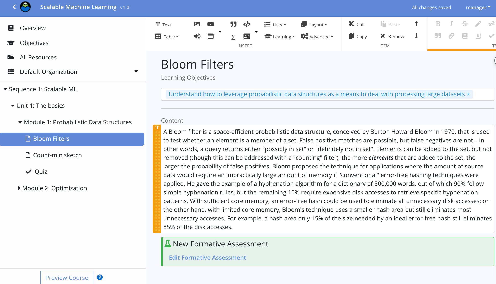

# OLI Course Authoring Platform

Web-based course authoring for Open Learning Initiative course packages. 
Register for an account to create and author course packages at [echo.oli.cmu.edu](https://echo.oli.cmu.edu). 

## Related repositories
* [authoring-client](https://github.com/Simon-Initiative/authoring-client) - Typescript/React/Redux editing client 
* [authoring-server](https://github.com/Simon-Initiative/authoring-server) - Java server, REST API, bridge to OLI 
* [authoring-eval](https://github.com/Simon-Initiative/authoring-eval) - Typescript/Node dynamic question evaluation engine
* [authoring-admin](https://github.com/Simon-Initiative/authoring-admin) - Elm admin client

## Setup instructions

See [Setup Instructions](docs/setup.md) for complete instructions on how to stand up the authoring
platform in a local development environment.

## License
This software is licensed under the [MIT License](./LICENSE) © 2019 Carnegie Mellon University
